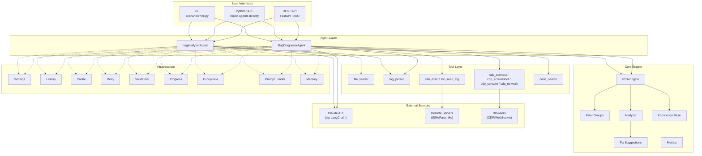
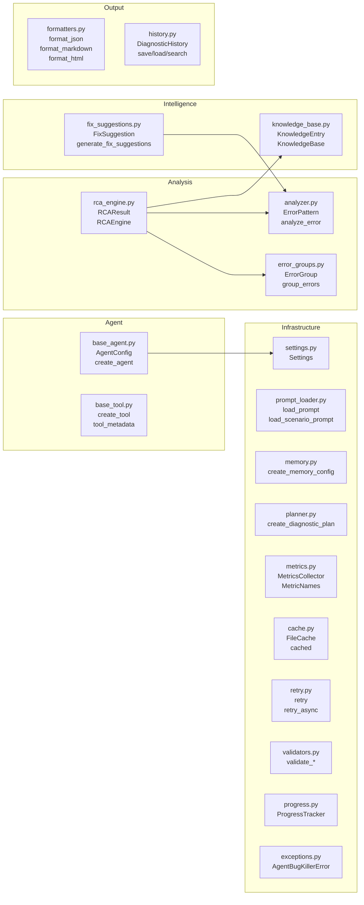
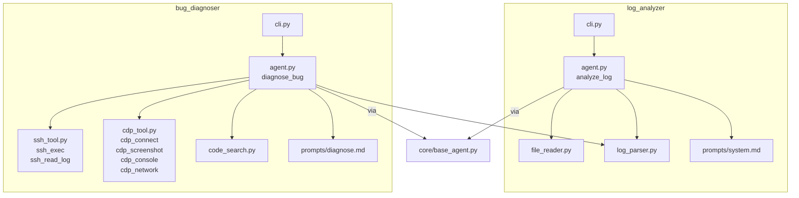
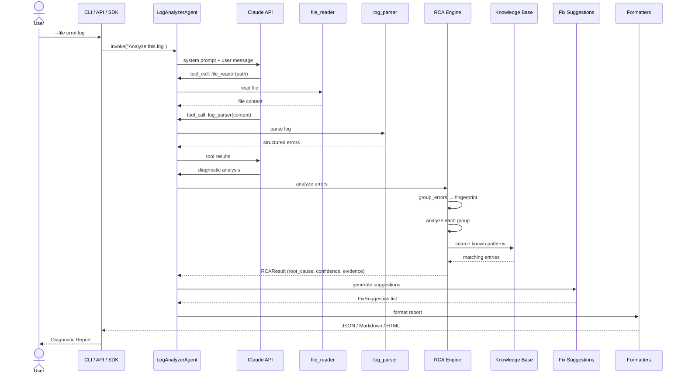
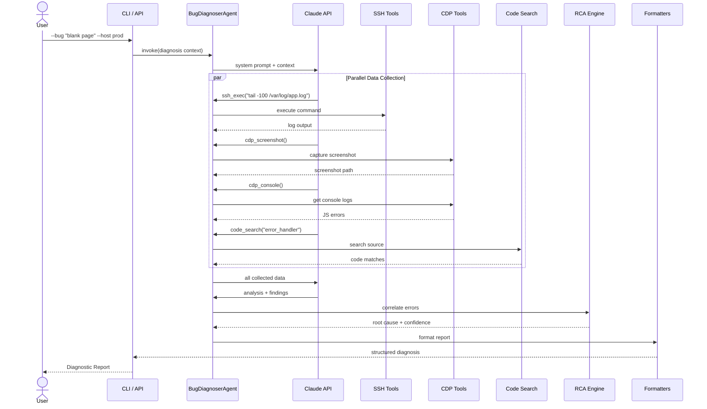
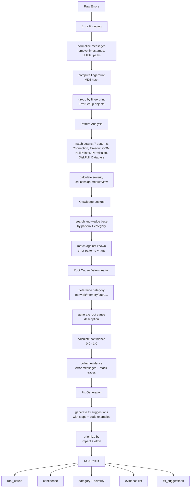
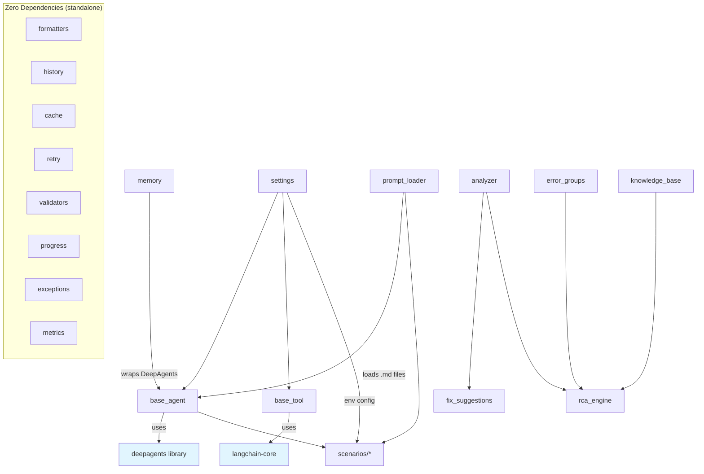
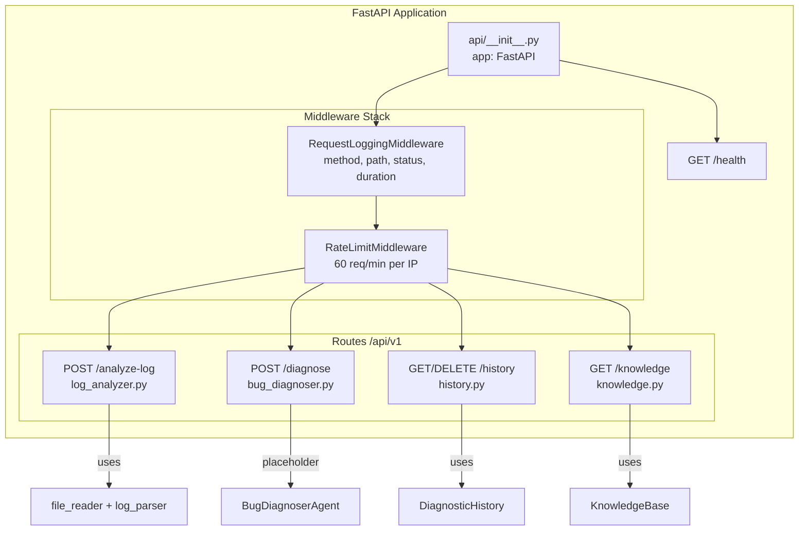
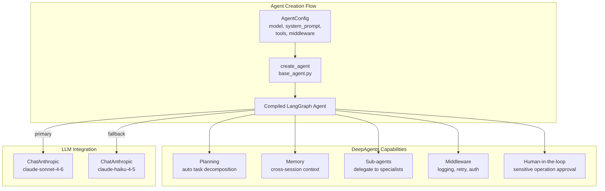
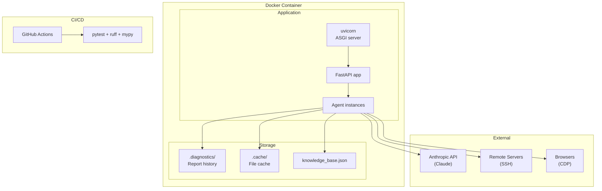

# Architecture

> Agent Bug Killer — System Architecture and Design

## Table of Contents

- [System Overview](#system-overview)
- [Layer Architecture](#layer-architecture)
- [Module Map](#module-map)
- [Data Flow: Log Analysis](#data-flow-log-analysis)
- [Data Flow: Bug Diagnosis](#data-flow-bug-diagnosis)
- [Data Flow: RCA Pipeline](#data-flow-rca-pipeline)
- [Core Module Dependencies](#core-module-dependencies)
- [API Architecture](#api-architecture)
- [Agent Architecture](#agent-architecture)
- [Deployment Architecture](#deployment-architecture)
- [Technology Stack](#technology-stack)

---

## System Overview



---

## Layer Architecture

```
┌─────────────────────────────────────────────────────────────────┐
│  Layer 1: User Interfaces                                        │
│  ┌──────────┐  ┌──────────┐  ┌──────────────────────────────┐  │
│  │   CLI    │  │  Python  │  │      REST API (FastAPI)       │  │
│  │ Click +  │  │   SDK    │  │                               │  │
│  │  Rich    │  │          │  │  Middleware:                   │  │
│  │          │  │          │  │  ├─ RequestLogging             │  │
│  │          │  │          │  │  └─ RateLimit (60 req/min)     │  │
│  └──────────┘  └──────────┘  └──────────────────────────────┘  │
├─────────────────────────────────────────────────────────────────┤
│  Layer 2: Agent Layer                                            │
│  ┌──────────────────────────────────────────────────────────┐   │
│  │  LogAnalyzerAgent          BugDiagnoserAgent              │   │
│  │  ├─ file_reader            ├─ ssh_exec / ssh_read_log     │   │
│  │  └─ log_parser             ├─ cdp_* (4 tools)             │   │
│  │                            ├─ code_search                 │   │
│  │                            └─ log_parser (shared)         │   │
│  │  Built on: LangChain DeepAgents + LangGraph               │   │
│  └──────────────────────────────────────────────────────────┘   │
├─────────────────────────────────────────────────────────────────┤
│  Layer 3: Core Engine                                            │
│  ┌─────────────┐  ┌─────────────┐  ┌──────────────────────┐   │
│  │ RCA Engine  │  │  Analyzer   │  │   Knowledge Base     │   │
│  │ 9-step      │  │  7 error    │  │   JSON-backed        │   │
│  │ analysis    │  │  patterns   │  │   search + category  │   │
│  └──────┬──────┘  └──────┬──────┘  └──────────────────────┘   │
│         │                │                                      │
│  ┌──────▼──────┐  ┌──────▼──────┐  ┌──────────────────────┐   │
│  │Error Groups │  │    Fix      │  │      Metrics         │   │
│  │Fingerprint +│  │ Suggestions │  │  Counter/Gauge/      │   │
│  │Aggregation  │  │             │  │  Histogram           │   │
│  └─────────────┘  └─────────────┘  └──────────────────────┘   │
├─────────────────────────────────────────────────────────────────┤
│  Layer 4: Infrastructure                                         │
│  ┌─────────┐ ┌─────────┐ ┌─────────┐ ┌─────────┐ ┌─────────┐ │
│  │Settings │ │History  │ │ Cache   │ │ Retry   │ │Validators│ │
│  │.env     │ │File-    │ │File-    │ │Exponent │ │Path     │ │
│  │based    │ │based    │ │based    │ │backoff  │ │Host/Port│ │
│  └─────────┘ └─────────┘ └─────────┘ └─────────┘ └─────────┘ │
│  ┌─────────┐ ┌─────────┐ ┌─────────┐ ┌─────────────────────┐ │
│  │Progress │ │Exception│ │Prompt   │ │      Memory         │ │
│  │Tracker +│ │Hierarchy│ │Loader   │ │  DeepAgents wrapper │ │
│  │Spinner  │ │         │ │Markdown │ │                     │ │
│  └─────────┘ └─────────┘ └─────────┘ └─────────────────────┘ │
└─────────────────────────────────────────────────────────────────┘
```

---

## Module Map

### Core Modules



### Scenario Modules



---

## Data Flow: Log Analysis



---

## Data Flow: Bug Diagnosis



---

## Data Flow: RCA Pipeline



---

## Core Module Dependencies



---

## API Architecture



### API Endpoints

| Endpoint | Method | Description |
|----------|--------|-------------|
| `/health` | GET | Health check + version |
| `/api/v1/analyze-log` | POST | Analyze log file or text |
| `/api/v1/diagnose` | POST | Diagnose production bug |
| `/api/v1/history` | GET | List diagnostic reports |
| `/api/v1/history/{id}` | GET | Get specific report |
| `/api/v1/history/{id}` | DELETE | Delete report |
| `/api/v1/history/search/{q}` | GET | Search reports |
| `/api/v1/knowledge` | GET | List knowledge entries |
| `/api/v1/knowledge/{id}` | GET | Get specific entry |
| `/api/v1/knowledge/search/{q}` | GET | Search knowledge base |

---

## Agent Architecture



### Agent Lifecycle

```
1. User Input ─→ 2. Agent receives message
                       ↓
                  3. LLM decides action
                       ↓
              ┌─── 4a. Tool Call ──→ Execute tool ──→ Return result ──┐
              │                                                        │
              └─── 4b. Final Answer ──→ Return to user                 │
                                                                       │
                  5. Loop back to step 3 until done ◄──────────────────┘
```

---

## Deployment Architecture



### Docker

```bash
# Build
docker build -t agent-bug-killer .

# Run
docker run -p 8000:8000 \
  -e ANTHROPIC_API_KEY=sk-ant-... \
  agent-bug-killer
```

---

## Technology Stack

| Layer | Technology | Purpose |
|-------|-----------|---------|
| **Agent Framework** | LangChain DeepAgents | Agent creation, planning, tool orchestration |
| **Runtime** | LangGraph | State management, streaming, persistence |
| **LLM** | Claude API (via langchain-anthropic) | Natural language understanding + tool use |
| **API** | FastAPI + uvicorn | RESTful API server |
| **SSH** | Paramiko | Remote server command execution |
| **Browser** | websockets | Chrome DevTools Protocol |
| **CLI** | Click + Rich | Command-line interface |
| **Config** | pydantic-settings | Environment-based configuration |
| **Testing** | pytest + pytest-asyncio + pytest-cov | Unit + integration + coverage |
| **Linting** | ruff | Code style + import sorting |
| **Type Check** | mypy (strict) | Static type analysis |
| **Build** | hatchling + uv | Package management |
| **Container** | Docker | Deployment |

---

## Design Principles

1. **Modularity** — Each module is independent and testable in isolation
2. **Extensibility** — New tools, agents, and analyzers can be added without modifying existing code
3. **Layer Separation** — Agents depend on Core, Core is framework-agnostic, Infrastructure has zero agent dependencies
4. **Fail-Safe** — Retry logic, input validation, structured exceptions, graceful degradation
5. **Observability** — Metrics collection, request logging, progress tracking
6. **Convention over Configuration** — Sensible defaults, override via environment variables
