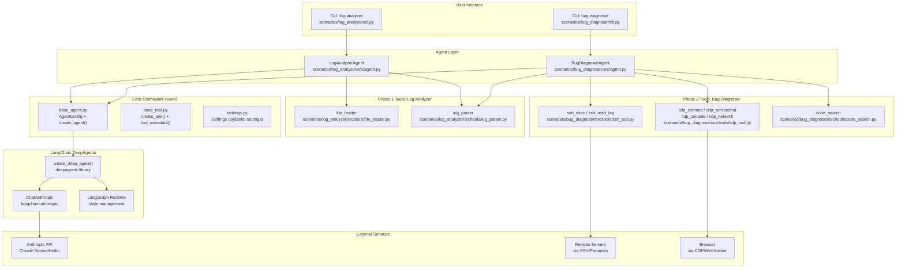
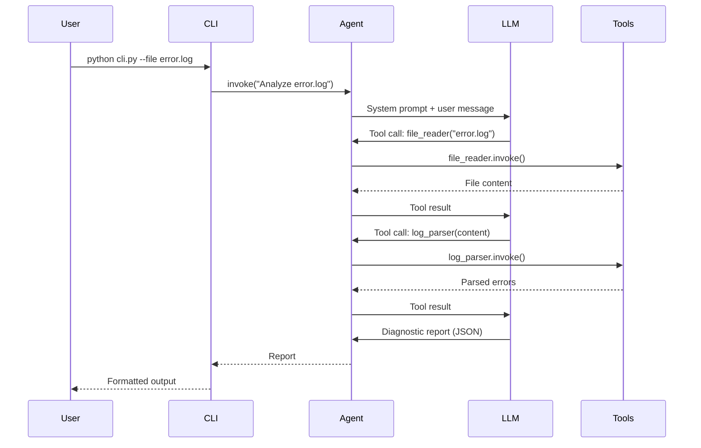
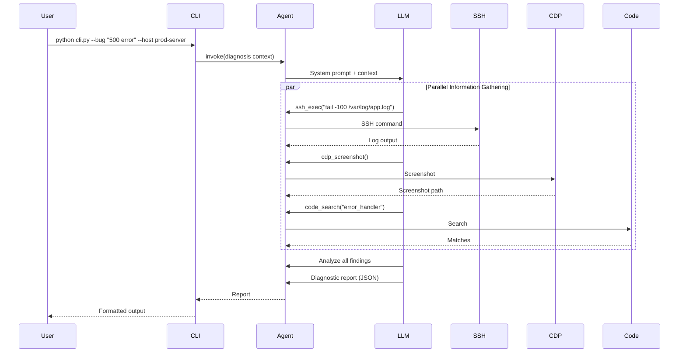
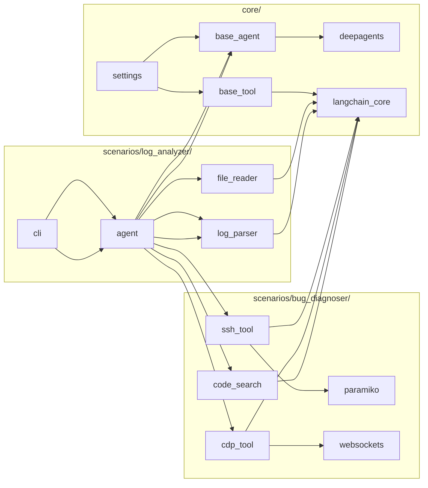
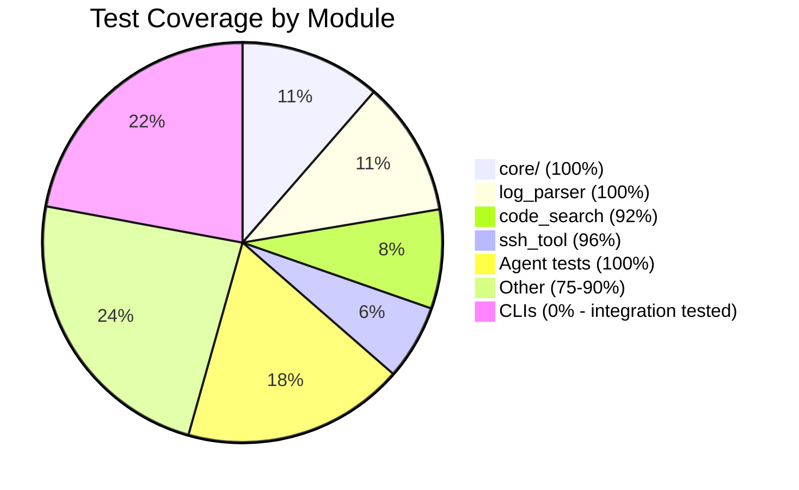

# Agent Bug Killer - Architecture Diagram

## System Overview

## Data Flow: Log Analysis

## Data Flow: Bug Diagnosis

## Module Dependency Graph

## Test Coverage Summary

## Technology Stack

| Layer | Technology | Purpose |
|-------|-----------|---------|
| Agent Framework | LangChain DeepAgents | Agent creation, planning, tool orchestration |
| LLM | Claude API (via langchain-anthropic) | Natural language understanding and generation |
| Runtime | LangGraph | State management, streaming, persistence |
| SSH | Paramiko | Remote server command execution |
| CDP | websockets | Chrome DevTools Protocol communication |
| CLI | Click + Rich | Command-line interface with rich output |
| Testing | pytest + pytest-asyncio | Unit and integration testing |
| Config | pydantic-settings | Environment-based configuration |
| Build | hatchling + uv | Package management and building |
